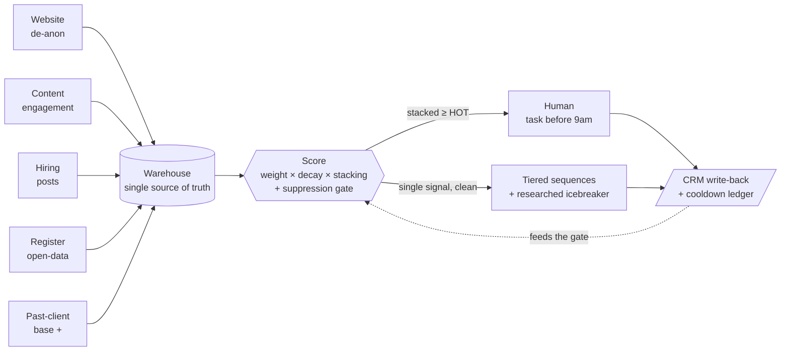

# Signal → Score → Route

### A real-time intent engine for outbound — that happens to be a growth engine

Every growth team has the same problem: **drowning in signals, yet still messaging the wrong person at the wrong time — or the same person too many times.**

This is an engine that fixes that. It pulls buying signals into one warehouse, scores each by **weight × recency-decay × stacking**, and decides — automatically — *who to reach, when, through which channel, and when to shut up.* Hot leads hit a human before 9am; everyone else flows into gated, personalized automation; and a suppression gate makes it **structurally impossible to over-message someone.**

The use case was a B2B recruitment agency's outbound. Strip the labels and it's a lifecycle machine — swap *"posted a job"* for *"abandoned a cart,"* *"past client"* for *"lapsed customer,"* and it's your CRM.

> Anonymized case study. No client data, names, or secrets in this repo — this is the architecture and the thinking, not the live system.

---

## The problem it replaced

The old motion was volume-first: blast the whole CRM cold, wire three tools together by hand, hope.

- Cold blast → **~2.6% reply**. A mis-targeted "trigger" campaign → **0.17%**.
- Campaigns stalled at **~0 sends for 9 days** — list exhaustion. The bottleneck was never the copy; it was **demand capture.**
- No signal capture, no scoring, no suppression. Every send weighted equally.

So the rebuild treats **signals as the product.**

---

## The machine



Five layers, left to right:

1. **Signal sources** — website de-anonymization, own-content engagement, live hiring posts (scrape → LLM extract → domain resolve), a national-register open-data feed keyed by company ID, and the durable **past-client base** (a prior relationship never decays).
2. **Warehouse** — one Postgres source of truth. Every other tool *mirrors* it, so there's no vendor lock-in and the data stays clean. Views are the API the automations read.
3. **Scoring brain** — the decision layer (below).
4. **Routing** — two lanes: cold → machine, hot → human.
5. **Execution & feedback** — sequencer, CRM write-back (every touch logged), a cooldown ledger, and a planned reweighting loop.

---

## The scoring, in one line

```
score = base (past-client, never decays)
      + Σ_type  min( Σ weight × decay , per-type cap )

decay:  1.5× (<24h) → 1.2× (7d) → 1.0× (2wk) → 0.7× (30d) → 0.3× (older)
tiers:  HOT ≥ 100   ·   WARM ≥ 50   ·   COOL < 50
```

**Stacking** is the point: because scores are capped per signal type, reaching HOT structurally requires **two independent kinds of evidence** — so a single noisy signal can never false-alarm a human. A weak lone signal just sits and decays until a second one stacks, or it fades to nothing. That's a threshold, not a timer.

**The gate** is mostly boolean and deterministic — open deal, a human touched them in the last 60 days, do-not-contact, a 14-day cross-channel cooldown → *suppressed*. An LLM is used for exactly one thing a boolean can't do: reading a free-text note for a buried *"don't contact these people."*

See [`docs/signal-model.md`](docs/signal-model.md) and [`examples/scoring.sql`](examples/scoring.sql).

---

## Five decisions I'm proud of

The build was fast. These are the calls that made it *good* — and they're the difference between a builder and a reckless AI-tinkerer.

1. **Open data > scraping.** For the market map, I used a government business register instead of scraping job boards — legal, free, and keyed by company ID, which means **deterministic matching** instead of fuzzy name-matching. One decision killed three problems at once.
2. **Don't AI a boolean.** "Is there an open deal?" is a database question — instant, free, auditable, identical every run. The LLM is reserved for the one job only it can do: interpreting free-text. Cheaper, and it can't hallucinate a wrong answer to a question the data already knows.
3. **Legal-first.** Before building a competitor-displacement feature, I researched the relevant unfair-competition statutes — and **parked the feature pending a lawyer's sign-off.** Then redesigned it to run entirely on *public* data so it stays clean. Shipping fast is worth nothing if it ships a liability.
4. **Decay + stacking** so scarce human attention is only spent on accounts with real, corroborated intent — never a single stray signal.
5. **Warehouse-as-truth.** The data model owns the logic (scoring lives in the database as views/functions); the tools are interchangeable front-ends. Swap the sequencer, swap the CRM — the brain doesn't move.

More in [`docs/decisions.md`](docs/decisions.md).

---

## What's honestly unfinished

I'd rather show the real edges than pretend it's done. ([full roadmap](docs/roadmap.md))

**Upstream (capture):** the open-data vacancy ingest is designed but not wired (it's the biggest, cleanest source); net-new companies need automated register-lookup tiering; the competitive layer is parked pending counsel.

**Downstream (close):** the cold lane is built and tested but held inactive until capture is live; the outcome-based reweighting loop needs ~30–50 closes before it means anything; a CRM de-duplication pass is generated but awaits a human owner-assignment review.

---

## Stack

Postgres warehouse · a workflow engine for orchestration (running 24/7, not on a laptop) · an LLM for extraction and free-text judgment · a neural search API for entity resolution · a CRM and an email/LinkedIn sequencer as interchangeable front-ends · national-register open data.

---

*This repository documents the architecture and reasoning of a system I built. It contains no client data, no real names, and no credentials — representative code demonstrates the patterns, not the live deployment.*
