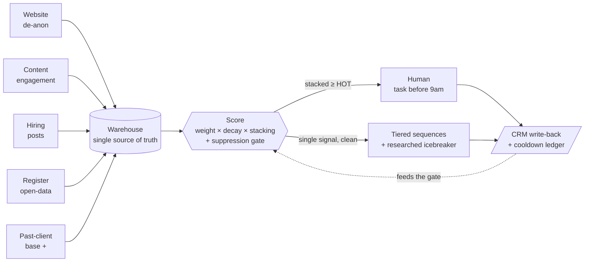

# Signal → Score → Route

### A real-time intent engine for outbound — that happens to be a growth engine

Every growth team has the same problem: **drowning in signals, yet still messaging the wrong person at the wrong time — or the same person too many times.**

This is an engine that fixes that. It pulls buying signals into one warehouse, scores each by **weight × recency-decay × stacking**, and decides — automatically — *who to reach, when, through which channel, and when to shut up.* Hot leads hit a human before 9am; everyone else flows into gated, personalized automation; and a suppression gate makes it **structurally impossible to over-message someone.**

The use case was a B2B recruitment agency's outbound. Strip the labels and it's a lifecycle machine — swap *"posted a job"* for *"abandoned a cart,"* *"past client"* for *"lapsed customer,"* and it's your CRM.

> Anonymized case study. No client data, names, or secrets in this repo — this is the architecture and the thinking, not the live system.

---

## The problem it replaced

The old motion was volume-first: blast the whole CRM cold, wire three tools together by hand, hope.

- Cold blast → **~2.6% reply**. A mis-targeted "trigger" campaign → **0.17%**.
- Campaigns stalled at **~0 sends for 9 days** — list exhaustion. The bottleneck was never the copy; it was **demand capture.**
- No signal capture, no scoring, no suppression. Every send weighted equally.

So the rebuild treats **signals as the product** — and specifically the signals a competitor *can't buy*:

| Signal-led ✅ | Reply | Volume-led ❌ | Reply |
|---|---|---|---|
| Past-placement base (first-party) | **16.9%** | Mass CRM blast | 2.63% |
| Active job posting (extracted, in the copy) | **15.9%** | Bought trigger, not used in the copy | 0.17% |

Same market, same senders — a ~6× spread decided entirely by *which signal* and *whether it's the spine of the message*. The originality test behind that left column ("can a competitor buy this exact signal off the shelf?") and the flywheel it creates: [`docs/alpha-signals.md`](docs/alpha-signals.md).

---

## The machine



Five layers, left to right:

1. **Signal sources** — website de-anonymization, own-content engagement, live hiring posts (scrape → LLM extract → domain resolve), a national-register open-data feed keyed by company ID, and the durable **past-client base** (a prior relationship never decays).
2. **Warehouse** — one Postgres source of truth. Every other tool *mirrors* it, so there's no vendor lock-in and the data stays clean. Views are the API the automations read. Why a warehouse *next to* a perfectly good CRM: [`docs/consolidation.md`](docs/consolidation.md).
3. **Scoring brain** — the decision layer (below).
4. **Routing** — two lanes: cold → machine, hot → human.
5. **Execution & feedback** — one multichannel sequencer (consolidated down from three tools — the migration and its landmines: [`docs/consolidation.md`](docs/consolidation.md)), CRM write-back on every touch, a cooldown ledger — and the reply side, which has its own repo: **[agentic-reply-engine](https://github.com/Miksh21/agentic-reply-engine)** — 12 reply routes, 11 autonomous, plus the learning loop that closes this diagram's feedback arrow.

---

## The scoring, in one line

```
score = base (past-client, never decays)
      + Σ_type  min( Σ weight × decay , per-type cap )

decay:  1.5× (<24h) → 1.2× (7d) → 1.0× (2wk) → 0.7× (30d) → 0.3× (older)
tiers:  HOT ≥ 100   ·   WARM ≥ 50   ·   COOL < 50
```

**Stacking** is the point: because scores are capped per signal type, reaching HOT structurally requires **two independent kinds of evidence** — so a single noisy signal can never false-alarm a human. A weak lone signal just sits and decays until a second one stacks, or it fades to nothing. That's a threshold, not a timer.

**The gate** is mostly boolean and deterministic — open deal, a human touched them in the last 60 days, do-not-contact, a 14-day cross-channel cooldown → *suppressed*. An LLM is used for exactly one thing a boolean can't do: reading a free-text note for a buried *"don't contact these people."*

See [`docs/signal-model.md`](docs/signal-model.md) and [`examples/scoring.sql`](examples/scoring.sql).

---

## Seven decisions I'm proud of

The build was fast. These are the calls that made it *good* — and they're the difference between a builder and a reckless AI-tinkerer.

1. **Open data > scraping.** For the market map, I used a government business register instead of scraping job boards — legal, free, and keyed by company ID, which means **deterministic matching** instead of fuzzy name-matching. One decision killed three problems at once.
2. **Don't AI a boolean.** "Is there an open deal?" is a database question — instant, free, auditable, identical every run. The LLM is reserved for the one job only it can do: interpreting free-text. Cheaper, and it can't hallucinate a wrong answer to a question the data already knows.
3. **Legal-first.** Before building a competitor-displacement feature, I researched the relevant unfair-competition statutes — and **parked the feature pending a lawyer's sign-off.** Then redesigned it to run entirely on *public* data so it stays clean. Shipping fast is worth nothing if it ships a liability.
4. **Decay + stacking** so scarce human attention is only spent on accounts with real, corroborated intent — never a single stray signal.
5. **Warehouse-as-truth.** The data model owns the logic (scoring lives in the database as views/functions); the tools are interchangeable front-ends. Swap the sequencer, swap the CRM — the brain doesn't move. (This is the decision that later made the [three-tools-to-one consolidation](docs/consolidation.md) a migration script instead of a re-architecture.)
6. **Tag the machine's own footprints.** Every activity the engine writes back to the CRM carries a 🤖 marker — and the "human touched this account recently" suppression rule *excludes* marked activities. Without that, the system reads its own write-backs as human touches and suppresses itself into silence.
7. **Let the platform's limits fix your sprawl.** The new sequencer capped inboxes per sender at 5; the old stack had drifted to 10. Instead of fighting the cap, it became the forcing function: rank by warmup health, keep the best five, drop the rest.

More in [`docs/decisions.md`](docs/decisions.md).

---

## Shipped, and what's next

The full inventory of what's running — warehouse, scoring views, signal capture, the 3-tier gate, the distributor, localized copy, the consolidated sequencer, the reply side — plus the expansion list, lives in [docs/roadmap.md](docs/roadmap.md).

The next moves all widen **capture**: the open-data vacancy ingest (the cleanest source becomes the primary one), automated net-new tiering, and contact-layer depth so every signal has a person to land on. One feature — the competitive-posture layer — is deliberately **parked pending legal sign-off**, and stays parked until counsel clears it.

---

## Stack

**Supabase/Postgres** warehouse · **n8n** orchestration (self-hosted, running 24/7, not on a laptop) · **Claude** for extraction and free-text judgment · **Exa** for entity resolution and why-now research · **lemlist** as the one multichannel sequencer (consolidated from **Instantly + HeyReach + Clay** — [the migration](docs/consolidation.md)) · **Deepline** for code-first enrichment plays (the Clay successor — pay-per-run, typically under €80/mo against a ~€350 seat) · the CRM as the deals-and-customers system of record · national-register open data.

The operating surface is deliberately **the terminal**: because all state lives in the warehouse and all logic in views, **Claude Code** works as the ops console — plain-English audits ("which accounts went HOT this week and why"), signal-pipeline spot-checks, and campaign builds against the sequencer's API, no dashboard in between. The tools execute; the warehouse decides; the terminal is where you talk to it.

## Siblings

- **[agentic-reply-engine](https://github.com/Miksh21/agentic-reply-engine)** — the reply half: everything that happens after a prospect answers. 12 routes, 11 autonomous, one human — plus the message ledger and the learning loop that closes this repo's feedback arrow.

---

*This repository documents the architecture and reasoning of a system I built. It contains no client data, no real names, and no credentials — representative code demonstrates the patterns, not the live deployment.*
